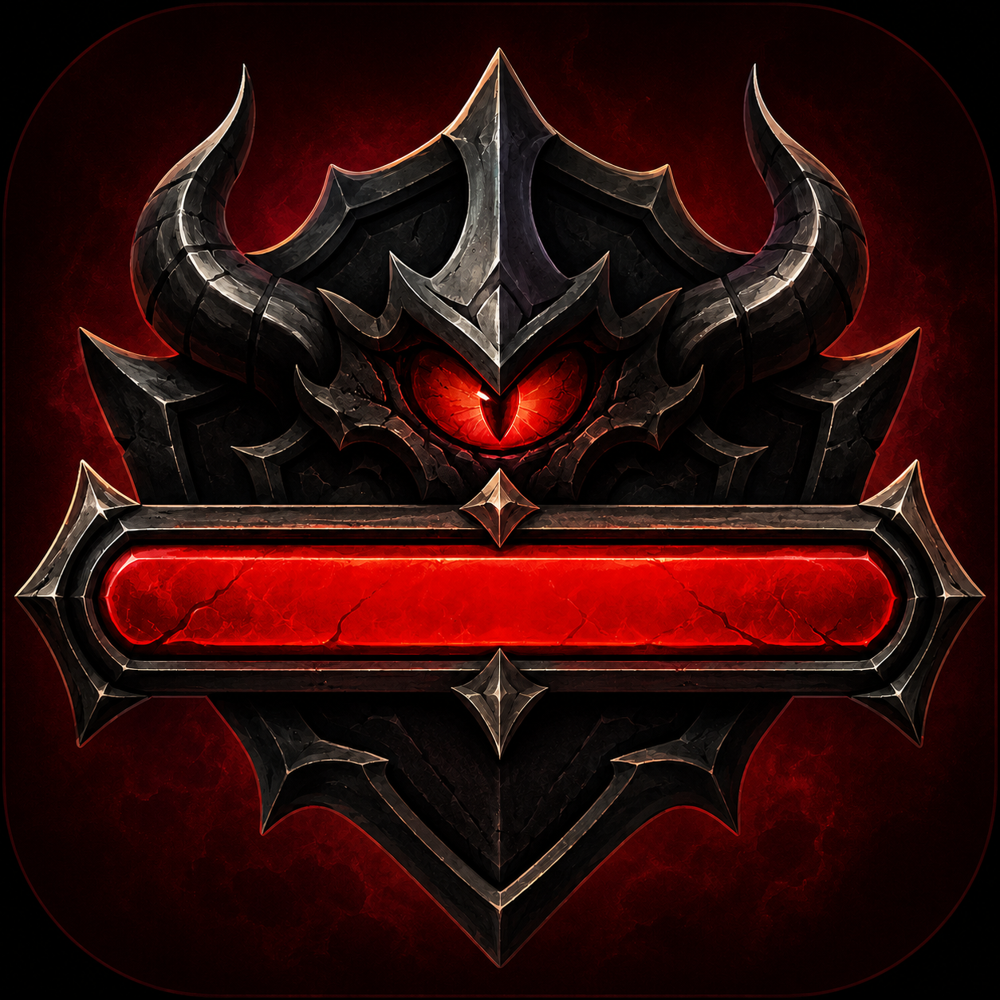

<div align="center">
  

  # BossBar - Tormenta20

  **Uma apresentação audiovisual de encontros de RPG, controlada pelo mestre e transmitida aos jogadores.**

  
  
  
  

  [Português](#português) · [English](#english)
</div>

---

# Português

## Sobre o BossBar

O **BossBar - Tormenta20** é um aplicativo desktop para mestres de RPG apresentarem encontros e lutas contra chefões de forma cinematográfica. O mestre pode transmitir a janela de apresentação pelo Discord, como sempre, ou hospedar uma sessão web temporária para os jogadores acompanharem pelo navegador.

Os jogadores não precisam instalar o aplicativo nem criar uma conta. No modo local, somente a janela de apresentação é compartilhada. No modo hospedado, o computador do mestre atua como servidor da sessão e publica apenas a apresentação e os dados necessários aos jogadores; os controles permanecem privados.

## Principais recursos

### Apresentação e controle

- Janela de apresentação em proporção 16:9, acompanhada por um painel de controle dedicado ao mestre.
- Janela compacta para controles globais do encontro.
- Suporte a até três chefões simultâneos, com HUDs que se reorganizam dinamicamente.
- Exibição opcional de vida atual, marcadores de fase e informações de escudo.
- Controles para mostrar ou esconder o HUD, aplicar blackout e iniciar ou encerrar a batalha.
- Histórico com até cinco ações reversíveis por `Ctrl + Z`.

### Sessão web opcional

- Hospedagem temporária iniciada e encerrada pelo próprio mestre, sem servidor permanente do BossBar.
- Acesso dos jogadores pelo navegador, sem instalar o aplicativo.
- Até dez jogadores simultâneos, com contagem de conexões, ping e indicação de qualidade.
- Confirmação do nome antes da entrada e troca de nome permitida enquanto a batalha não começou.
- Pré-carregamento autenticado das mídias da sessão antes de revelar a apresentação no navegador.
- Eventos permanecem em uma fila ordenada até suas mídias serem transferidas e reconhecidas pelo navegador.
- Novas entradas durante uma batalha dependem da aprovação explícita do mestre.
- Convite protegido por código de sala e token temporário.
- Túnel HTTPS temporário criado automaticamente; o modo local continua disponível e não abre nenhuma porta de rede.

### Chefões e combate

- Nome, vida atual e máxima, ataque, tiro, perícias, defesas corpo a corpo e à distância, redução de dano e escudo.
- Dano, cura e cura completa, incluindo golpes parcelados com a sintaxe `total/parcelas`.
- Redução de dano opcional e efeitos próprios para dano, crítico, cura, escudo atingido e escudo quebrado.
- Animações de impacto, barras residuais de dano e cura, números flutuantes e sequência visual de derrota.
- Ações publicadas como padrão ou grave para antecipar aos jogadores o próximo movimento do chefão.

### Condições e turnos

- 35 condições de Tormenta20, mais um status personalizado.
- Ícones, descrições e duração em turnos diretamente no HUD.
- Progressões, incompatibilidades e modificadores automáticos entre condições compatíveis.
- Dano recorrente por fórmulas de dados, incluindo expressões como `2d6 + 1d8 - 3`.
- Controle de turnos e aplicação automática dos efeitos ativos.

### Cenas e fases

- Editor de cena com até oito fases.
- Transições acionadas por limites de vida definidos pelo mestre.
- Fundos próprios por fase usando imagens, GIFs ou vídeos em loop e sem áudio.
- Transições por fade, fade para blackout ou blackout imediato.
- Alteração de chefões, atributos, ações e mídia entre fases.
- Playlists e sons de transição independentes para cada fase.

### Áudio

- Música reproduzida exclusivamente pela janela dos jogadores.
- Playlists por fase com reprodução, pausa, busca, faixa anterior/seguinte, loop e mute.
- Soundboard com até 20 atalhos MP3, reprodução simultânea e controles próprios.
- Efeitos sonoros internos e personalizados para dano, crítico, cura e escudo.
- Controles separados e persistentes para música, soundboard e efeitos sonoros.

### Biblioteca de encontros

- Salva encontros completos com chefões, atributos, vida, condições, cena, mídia, playlists e soundboard.
- Carrega encontros anteriormente preparados sem revelar antecipadamente o conteúdo aos jogadores.
- Salvamento automático periódico e salvamento adicional ao encerrar o aplicativo.
- Identificação de arquivos locais ausentes e opção de localizar substitutos.

## Instalação para o mestre

1. Abra a página da [versão mais recente](https://github.com/Duaaaal/BossBar-T20/releases/latest).
2. Baixe o instalador `.exe` disponível em **Assets**.
3. Execute o instalador e abra o **BossBar - Tormenta20**.

> O Windows pode exibir um aviso do SmartScreen quando um instalador não possui assinatura digital reconhecida. Baixe o aplicativo somente pelo canal oficial de distribuição e confira a versão antes de executá-lo.

Os jogadores não precisam realizar esses passos. No modo hospedado, eles acessam o convite pelo navegador; no modo local, assistem à transmissão escolhida pelo mestre.

## Uso rápido

1. Na tela inicial, escolha **Novo encontro**, **Carregar encontro** ou **Hospedar encontro**.
2. Preencha os dados dos chefões no painel de controle.
3. Abra **Editar cena** para configurar fases, fundos, transições e músicas.
4. Aplique e salve as alterações desejadas.
5. Clique em **Iniciar batalha**.
6. No modo local, compartilhe somente a janela **Apresentação - BossBar T20** no Discord. No modo hospedado, copie o link HTTPS gerado automaticamente e envie-o aos jogadores.

Para manter os controles privados, compartilhe a janela específica do aplicativo — não a tela ou o monitor inteiro. O painel do mestre é uma janela separada e sincronizada, posicionada junto à apresentação.

## Hospedagem pela Internet

Ao escolher **Hospedar encontro**, o BossBar baixa na primeira utilização uma versão fixa do componente oficial `cloudflared`, confere sua assinatura SHA-256, inicia o servidor somente em `127.0.0.1` e cria um Cloudflare Quick Tunnel. A janela do mestre recebe automaticamente um endereço aleatório `https://*.trycloudflare.com` com as credenciais temporárias da sala.

Não é necessário informar IP, abrir portas no roteador, configurar firewall, possuir domínio ou instalar certificado. O link expira quando a sala é encerrada e um novo endereço é gerado na próxima hospedagem.

Quick Tunnels são um serviço externo gratuito da Cloudflare, sem garantia de disponibilidade ou SLA e destinado oficialmente a testes e usos temporários. A Cloudflare limita cada túnel rápido a 200 requisições simultâneas e não oferece suporte a Server-Sent Events; o BossBar mantém uma conexão WebSocket persistente para os eventos da sessão. O uso do serviço e do `cloudflared` está sujeito à [documentação e aos termos informados pela Cloudflare](https://developers.cloudflare.com/cloudflare-one/networks/connectors/cloudflare-tunnel/do-more-with-tunnels/trycloudflare/).

A implementação anterior para IP, DNS ou proxy fornecido manualmente permanece preservada internamente como fallback técnico, mas não aparece no fluxo normal do aplicativo.

## Arquivos de mídia

- Fundos: formatos comuns de imagem, GIF e vídeo, como PNG, JPEG, GIF, WebP e MP4.
- Música, transições e soundboard: arquivos MP3.
- Limite por arquivo selecionado pelo aplicativo: 100 MB.
- Vídeos de fundo são reproduzidos em loop e sem áudio.

Arquivos muito grandes ou muitas mídias simultâneas podem aumentar o consumo de memória e reduzir a fluidez do aplicativo.

## Desenvolvimento

### Requisitos

- Windows 10 ou 11, em 64 bits.
- [Node.js](https://nodejs.org/) com npm.
- Git, caso o projeto seja obtido por clone.

### Executar localmente

```powershell
git clone https://github.com/Duaaaal/BossBar-T20.git
cd BossBar-T20
npm ci
npm.cmd start
```

Execute os comandos na pasta que contém o `package.json`. No PowerShell, use `npm.cmd` no lugar de `npm` caso a política de execução impeça o carregamento de `npm.ps1`.

### Verificar e gerar o aplicativo

```powershell
npm run verify
npm run package
npm run make
```

- `verify`: executa lint, verificação de tipos e testes automatizados.
- `package`: gera uma versão local não instalável do aplicativo.
- `make`: cria os artefatos distribuíveis e o instalador para Windows.

Os arquivos gerados ficam no diretório `out/`.

### Testes avançados

Instale os navegadores controlados pelo Playwright uma vez após o `npm ci`:

```powershell
npx.cmd playwright install chromium firefox
```

Os projetos web cobrem Chromium, Chrome for Testing, Microsoft Edge e Firefox. Para executar a suíte completa ou uma parte específica:

```powershell
npm.cmd run fixtures:media
npm.cmd run test:e2e:web
npm.cmd run test:e2e:electron
npm.cmd run test:e2e
npm.cmd run coverage:netcode
```

- `fixtures:media`: gera arquivos PNG, GIF, MP3 e MP4 pequenos e determinísticos, exclusivos para testes.
- `test:e2e:web`: valida compatibilidade, carregamento de mídia, latência, desconexão e reconexão, eventos fora de ordem, até dez clientes simultâneos e regressões visuais do HUD.
- `test:e2e:electron`: empacota o aplicativo e verifica o fluxo integrado das janelas de início, mestre, apresentação e painel.
- `coverage:netcode`: produz relatórios de cobertura textual, HTML e LCOV para o servidor multiplayer, estado público compartilhado e cliente web.

Relatórios navegáveis ficam em `playwright-report/`, diagnósticos como traces, screenshots e vídeos de falha em `test-results/`, e cobertura em `coverage/`. As referências visuais versionadas ficam em `tests/e2e/snapshots/`.

Os testes Electron usam automaticamente um perfil temporário isolado por meio de `BOSSBAR_E2E` e `BOSSBAR_E2E_PROFILE`; assim, encontros, configurações e mídias do perfil real não são alterados. Não reutilize esses sinalizadores em uma sessão normal.

O workflow `quality.yml` executa verificação estática, testes, cobertura, compatibilidade web, fluxo Electron e packaging em um Windows descartável a cada push e pull request. O pacote de teste é criado fora do workspace do runner e disponibilizado como artefato temporário. O workflow `tunnel-smoke.yml` verifica o Quick Tunnel semanalmente ou sob acionamento manual, sem torná-lo uma dependência de cada push.

## Tecnologias

- Electron e Electron Forge
- React
- TypeScript
- Vite
- Node.js
- Fastify
- Socket.IO
- Zod

## Desenvolvimento assistido por IA

O BossBar foi idealizado e dirigido por **Brian Nascimento** e desenvolvido com a assistência de ferramentas de inteligência artificial. Essas ferramentas auxiliaram em atividades como implementação, revisão de código, documentação, testes e refatoração. As decisões sobre requisitos, experiência do usuário, validação e publicação do projeto permanecem sob responsabilidade do autor.

## Estrutura do projeto

```text
BossBar-T20/
├── assets/                  # Recursos internos distribuídos com o aplicativo
├── scripts/                 # Scripts auxiliares de build
├── src/
│   ├── main.ts              # Processo principal, janelas, estado e IPC
│   ├── preload-*.ts         # APIs isoladas por tipo de janela
│   ├── player.tsx           # Apresentação dos jogadores
│   ├── control.tsx          # Painel acoplado do mestre
│   ├── master.tsx           # Controles globais
│   ├── scene-editor.tsx     # Editor de cenas e fases
│   ├── library.tsx          # Biblioteca de encontros
│   ├── soundboard.tsx       # Gerenciador do soundboard
│   ├── web-player.ts        # Apresentação acessada pelo navegador
│   ├── multiplayer/         # Servidor temporário, autenticação e proteção da sessão
│   └── shared/              # Tipos, regras e utilitários compartilhados
├── tests/                   # Testes automatizados
├── forge.config.ts          # Empacotamento do Electron Forge
└── package.json             # Metadados, scripts e dependências
```

## Privacidade e segurança

- O modo local não exige conta, servidor externo nem conexão dos jogadores.
- O servidor web e o túnel permanecem desligados até o mestre escolher **Hospedar encontro** e são encerrados junto com a sessão.
- No modo hospedado, os navegadores conectados recebem a apresentação, as mídias publicadas e somente o estado público necessário; atributos privados e comandos do mestre não são enviados.
- Código de sala, token temporário, limite de dez jogadores, validação de origem, limitação de requisições e validação de arquivos reduzem a superfície de ataque.
- Mídias e encontros escolhidos pelo usuário permanecem no computador no modo local. No modo hospedado, as mídias usadas na apresentação atravessam o Cloudflare Quick Tunnel até os jogadores conectados.
- Ao encerrar a sala, downloads, decodificadores e caches temporários da sessão são descartados; os assets empacotados no aplicativo não são removidos.
- As janelas usam APIs de preload separadas e comunicação IPC validada entre os processos do aplicativo.
- Dependências devem ser instaladas a partir do arquivo de lock com `npm ci` e verificadas antes de cada lançamento.

Nenhum software pode oferecer segurança absoluta. Use apenas builds obtidas do canal oficial e mantenha o aplicativo atualizado.

## Licenciamento

O BossBar é um projeto **open source**, distribuído sob a [Licença MIT](LICENSE). Você pode usar, copiar, modificar, integrar, publicar, distribuir, sublicenciar e vender cópias do software, desde que o aviso de direitos autorais e o texto da licença sejam preservados nas cópias ou em partes substanciais do projeto.

Consulte o arquivo [LICENSE](LICENSE) para conhecer os termos completos. Nomes, marcas e propriedades intelectuais de terceiros mencionados pelo projeto permanecem sujeitos aos direitos de seus respectivos titulares.

## Aviso legal

BossBar é uma ferramenta independente, criada por fã, e não é afiliada nem endossada pela Jambô Editora ou pelos detentores da propriedade intelectual de Tormenta20. Tormenta20 e marcas relacionadas pertencem aos seus respectivos titulares.

Criado por **Brian Nascimento**.

---

# English

## About BossBar

**BossBar - Tormenta20** is a desktop application that helps game masters present cinematic RPG encounters and boss battles. The game master can stream the presentation window through Discord, as before, or host a temporary web session that players can watch in their browsers.

Players do not need to install the application or create an account. In local mode, only the presentation window is shared. In hosted mode, the game master's computer acts as the session server and publishes only the presentation and player-facing data; all controls remain private.

## Main features

### Presentation and control

- A 16:9 presentation window accompanied by a dedicated game-master control panel.
- A compact window for global encounter controls.
- Support for up to three simultaneous bosses with dynamically rearranged HUDs.
- Optional current-health display, phase markers, and shield information.
- Controls to show or hide the HUD, trigger a blackout, and start or end the battle.
- Up to five reversible changes through `Ctrl + Z`.

### Optional web session

- Temporary self-hosting started and stopped by the game master, with no permanent BossBar server.
- Browser access for players without installing the application.
- Up to ten simultaneous players with connection count, ping, and connection-quality indicators.
- Name confirmation before joining, with name changes allowed until the battle starts.
- Authenticated session-media preloading before the browser reveals the presentation.
- Events stay in an ordered queue until their media has been transferred and recognized by the browser.
- New players joining an ongoing battle require explicit game-master approval.
- Invitations protected by an ephemeral room code and token.
- An automatically created temporary HTTPS tunnel; local mode remains available and opens no network port.

### Bosses and combat

- Name, current and maximum health, melee attack, ranged attack, skills, melee and ranged defense, damage reduction, and shield.
- Damage, healing, and full healing, including multi-hit input using the `total/hits` syntax.
- Optional damage reduction and dedicated effects for damage, critical hits, healing, shield hits, and shield breaks.
- Impact animations, delayed damage and healing bars, floating numbers, and a defeat sequence.
- Standard or critical action announcements that warn players about the boss's next move.

### Conditions and turns

- 35 Tormenta20 conditions plus one custom status.
- Icons, descriptions, and turn duration displayed directly on the HUD.
- Automatic condition progression, incompatibility rules, and attribute modifiers.
- Recurring damage through dice formulas such as `2d6 + 1d8 - 3`.
- Turn tracking and automatic processing of active effects.

### Scenes and phases

- A scene editor supporting up to eight phases.
- Transitions triggered by health thresholds chosen by the game master.
- Per-phase backgrounds using images, animated GIFs, or muted looping videos.
- Fade, fade-to-blackout, and immediate blackout transitions.
- Per-phase changes to bosses, attributes, actions, and media.
- Independent playlists and transition sounds for each phase.

### Audio

- Music playback occurs exclusively in the players' presentation window.
- Per-phase playlists with playback, pause, seeking, previous/next track, loop, and mute controls.
- A 20-slot MP3 soundboard with concurrent playback and dedicated controls.
- Bundled and custom sound effects for damage, critical hits, healing, and shields.
- Separate persistent controls for music, soundboard, and sound-effect volume.

### Encounter library

- Saves complete encounters, including bosses, attributes, health, conditions, scenes, media, playlists, and soundboard assignments.
- Loads prepared encounters without revealing their content to players beforehand.
- Periodic autosaves and an additional save when the application closes.
- Detection of missing local files with an option to locate replacements.

## Installation for the game master

1. Open the [latest release](https://github.com/Duaaaal/BossBar-T20/releases/latest) page.
2. Download the `.exe` installer listed under **Assets**.
3. Run the installer and open **BossBar - Tormenta20**.

> Windows may show a SmartScreen warning when an installer does not have a recognized digital signature. Download the application only from its official distribution channel and check the version before running it.

Players do not need to follow these steps. In hosted mode, they open the invitation in a browser; in local mode, they watch the stream selected by the game master.

## Quick start

1. On the launcher, choose **Novo encontro** (New encounter), **Carregar encontro** (Load encounter), or **Hospedar encontro** (Host encounter).
2. Fill in the boss information in the control panel.
3. Open **Editar cena** (Edit scene) to configure phases, backgrounds, transitions, and music.
4. Apply and save the desired changes.
5. Click **Iniciar batalha** (Start battle).
6. In local mode, share only the **Apresentação - BossBar T20** window in Discord. In hosted mode, copy the automatically generated HTTPS link and send it to the players.

To keep controls private, share the specific application window rather than the entire screen or monitor. The game-master panel is a separate synchronized window positioned next to the presentation.

## Hosting over the Internet

When the game master selects **Hospedar encontro**, BossBar downloads a pinned version of the official `cloudflared` component on first use, verifies its SHA-256 signature, starts the server on `127.0.0.1` only, and creates a Cloudflare Quick Tunnel. The game-master window automatically receives a random `https://*.trycloudflare.com` address with the room's ephemeral credentials.

No public IP, router port forwarding, firewall configuration, domain, or manually installed certificate is required. The link expires when the room closes, and a new address is generated for the next hosted session.

Quick Tunnels are a free third-party Cloudflare service without an uptime guarantee or SLA and are officially intended for testing and temporary use. Cloudflare limits each Quick Tunnel to 200 concurrent requests and does not support Server-Sent Events; BossBar keeps a persistent WebSocket connection for session events. Use of the service and `cloudflared` is subject to [Cloudflare's published documentation and terms](https://developers.cloudflare.com/cloudflare-one/networks/connectors/cloudflare-tunnel/do-more-with-tunnels/trycloudflare/).

The previous manually supplied IP, DNS, or proxy implementation remains preserved internally as a technical fallback but is hidden from the normal application flow.

## Media files

- Backgrounds: common image, GIF, and video formats such as PNG, JPEG, GIF, WebP, and MP4.
- Music, transitions, and soundboard: MP3 files.
- Application file-size limit: 100 MB per selected file.
- Background videos play muted and in a loop.

Very large files or many simultaneous media assets may increase memory usage and reduce application performance.

## Development

### Requirements

- 64-bit Windows 10 or 11.
- [Node.js](https://nodejs.org/) with npm.
- Git when cloning the project.

### Run locally

```powershell
git clone https://github.com/Duaaaal/BossBar-T20.git
cd BossBar-T20
npm ci
npm.cmd start
```

Run these commands from the directory containing `package.json`. In PowerShell, use `npm.cmd` instead of `npm` if the execution policy blocks `npm.ps1`.

### Verify and build

```powershell
npm run verify
npm run package
npm run make
```

- `verify`: runs linting, type checking, and automated tests.
- `package`: creates a local unpacked application build.
- `make`: creates distributable artifacts and the Windows installer.

Generated files are written to the `out/` directory.

### Advanced testing

Install the Playwright-managed browsers once after `npm ci`:

```powershell
npx.cmd playwright install chromium firefox
```

The web projects cover Chromium, Chrome for Testing, Microsoft Edge, and Firefox. Run the full suite or an individual layer with:

```powershell
npm.cmd run fixtures:media
npm.cmd run test:e2e:web
npm.cmd run test:e2e:electron
npm.cmd run test:e2e
npm.cmd run coverage:netcode
```

- `fixtures:media`: generates small deterministic PNG, GIF, MP3, and MP4 files used exclusively by tests.
- `test:e2e:web`: verifies compatibility, media loading, latency, disconnection and reconnection, out-of-order events, up to ten simultaneous clients, and HUD visual regressions.
- `test:e2e:electron`: packages the application and verifies the integrated launcher, game-master, presentation, and control-panel window flow.
- `coverage:netcode`: produces text, HTML, and LCOV coverage reports for the multiplayer server, shared public state, and web client.

Browsable reports are written to `playwright-report/`, failure diagnostics such as traces, screenshots, and videos to `test-results/`, and coverage to `coverage/`. Versioned visual baselines live in `tests/e2e/snapshots/`.

Electron tests automatically use a disposable profile through `BOSSBAR_E2E` and `BOSSBAR_E2E_PROFILE`, keeping real encounters, settings, and media untouched. Do not reuse these flags for a normal session.

The `quality.yml` workflow runs static verification, tests, coverage, web compatibility, the Electron flow, and packaging on a disposable Windows runner for every push and pull request. The test package is built outside the runner workspace and uploaded as a temporary artifact. The `tunnel-smoke.yml` workflow checks the Quick Tunnel weekly or on manual dispatch without making that external service a dependency of every push.

## Technology stack

- Electron and Electron Forge
- React
- TypeScript
- Vite
- Node.js
- Fastify
- Socket.IO
- Zod

## AI-assisted development

BossBar was conceived and directed by **Brian Nascimento** and developed with the assistance of artificial-intelligence tools. These tools supported activities such as implementation, code review, documentation, testing, and refactoring. Decisions concerning requirements, user experience, validation, and publication remain the author's responsibility.

## Project structure

```text
BossBar-T20/
├── assets/                  # Internal resources shipped with the application
├── scripts/                 # Supporting build scripts
├── src/
│   ├── main.ts              # Main process, windows, state, and IPC
│   ├── preload-*.ts         # APIs isolated by window type
│   ├── player.tsx           # Players' presentation
│   ├── control.tsx          # Docked game-master panel
│   ├── master.tsx           # Global controls
│   ├── scene-editor.tsx     # Scene and phase editor
│   ├── library.tsx          # Encounter library
│   ├── soundboard.tsx       # Soundboard manager
│   ├── web-player.ts        # Browser-accessible presentation
│   ├── multiplayer/         # Temporary server, authentication, and session protection
│   └── shared/              # Shared types, rules, and utilities
├── tests/                   # Automated tests
├── forge.config.ts          # Electron Forge packaging configuration
└── package.json             # Metadata, scripts, and dependencies
```

## Privacy and security

- Local mode requires no account, external server, or player connection.
- The web server and tunnel stay disabled until the game master selects **Hospedar encontro** and stop with the hosted session.
- In hosted mode, connected browsers receive the presentation, published media, and only the required public state; private attributes and game-master commands are not sent.
- A room code, ephemeral token, ten-player limit, origin validation, rate limiting, and file validation reduce the attack surface.
- User-selected media and encounters remain on the computer in local mode. In hosted mode, presentation media travels through the Cloudflare Quick Tunnel to connected players.
- Closing the room discards session downloads, decoders, and temporary caches without removing bundled application assets.
- Windows use separate preload APIs and validated IPC communication between application processes.
- Dependencies should be installed from the lockfile with `npm ci` and verified before every release.

No software can guarantee absolute security. Use builds obtained from the official distribution channel and keep the application updated.

## Licensing

BossBar is an **open-source** project distributed under the [MIT License](LICENSE). You may use, copy, modify, merge, publish, distribute, sublicense, and sell copies of the software, provided that the copyright notice and license text remain included in copies or substantial portions of the project.

See [LICENSE](LICENSE) for the complete terms. Third-party names, trademarks, and intellectual property mentioned by the project remain subject to the rights of their respective owners.

## Legal notice

BossBar is an independent fan-made tool and is not affiliated with or endorsed by Jambô Editora or the owners of the Tormenta20 intellectual property. Tormenta20 and related trademarks belong to their respective owners.

Created by **Brian Nascimento**.
